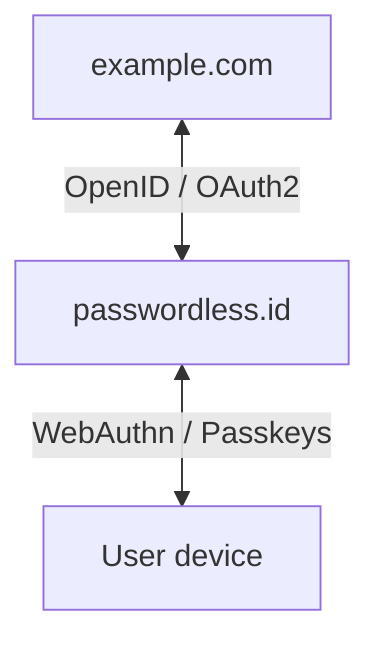
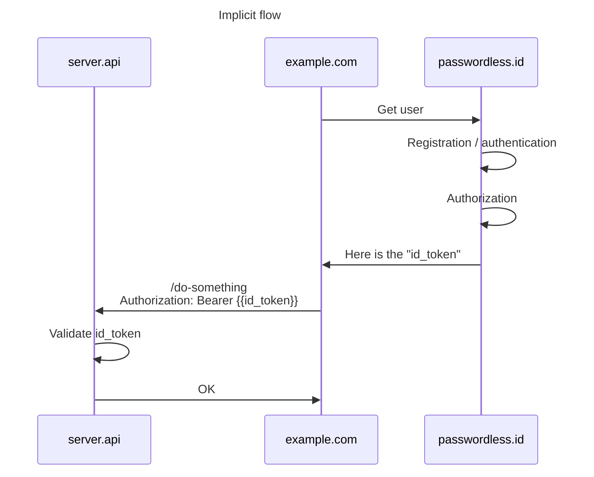
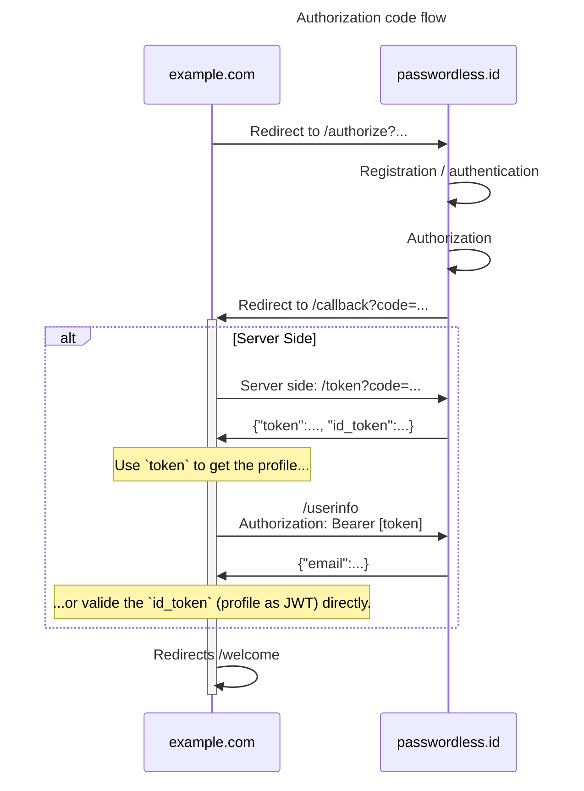

The big picture
===============

```mermaid
flowchart
    example.com <--OpenID / OAuth2--> passwordless.id
    passwordless.id <--WebAuthn / Passkeys--> user[User device]
```

The implicit flow
-----------------

```mermaid
sequenceDiagram
    title Implicit flow
    participant server.api
    example.com->>passwordless.id: Get user
    passwordless.id->>passwordless.id: Registration / authentication
    passwordless.id->>passwordless.id: Authorization
    passwordless.id->>example.com: Here is the "id_token"
    example.com->>server.api: /do-something <br/> Authorization: Bearer {{id_token}}
    server.api->>server.api: Validate id_token
    server.api->>example.com: OK
```

The authorization code flow
---------------------------

```mermaid
sequenceDiagram
    title Authorization code flow
    example.com->>passwordless.id: Redirect to /authorize?...
    passwordless.id->>passwordless.id: Registration / authentication
    passwordless.id->>passwordless.id: Authorization
    passwordless.id->>+example.com: Redirect to /callback?code=...
    alt Server Side
        example.com->>passwordless.id: Server side: /token?code=...
        passwordless.id->>example.com: {"token":..., "id_token":...}
        Note over example.com: Use `token` to get the profile...
        example.com->>passwordless.id: /userinfo <br/> Authorization: Bearer [token]
        passwordless.id->>example.com: {"email":...}
        Note over example.com: ...or valide the `id_token` (profile as JWT) directly.
    end
    example.com->>-example.com: Redirects /welcome
```