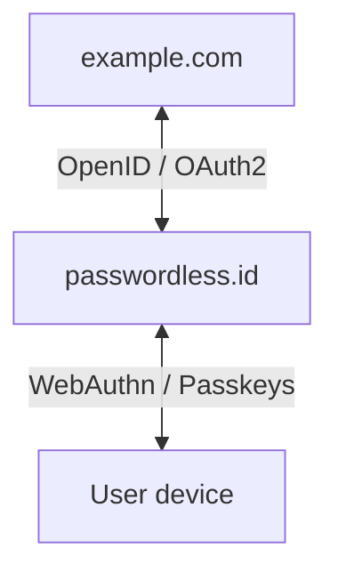
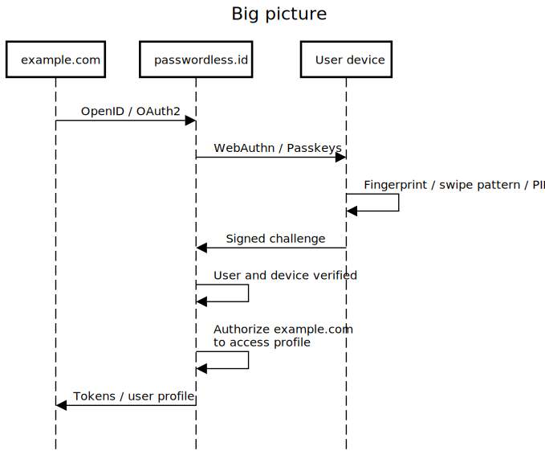
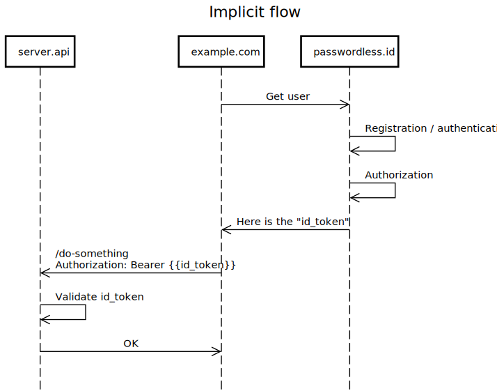
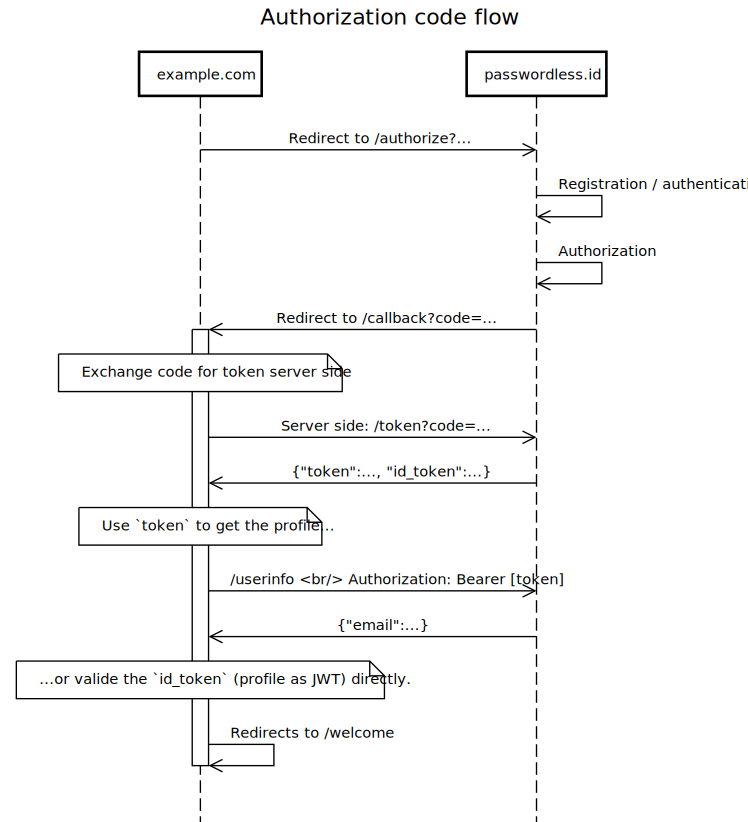

The big picture
===============

With so many protocols and tools, it's not always easy to have a clear understanding of authentication related technologies. The goal of this overview is to provide a clear understanding of what passwordless.id is, and how to interact with it.

Passwordless.ID is an "identity provider". It authenticates the user, manages the user profile, its registered devices and ensures 2FA (two factor authentication). In other words, Passwordless.ID takes care of *authentication*, using the new WebAuthn protocol, also known as passkeys, in order to provide a smoother user experience while being more secure.

Passwordless.ID also enables third-party webapps to read the user's profile, as long as the user gives its consent of course. Websites can request to read the user profile using the OpenID / OAuth2 protocol, which can be summarized as "Dear passwordless.id user, please allow me to read your nickname, email...". OAuth2 is the *authorization* protocol, while the OpenID protocol, built on top, offers a set of standards regarding how the profile should look like, how to discover the proper URLs to call, etc. That way, the user's profile can be read similarly from various identity providers like Microsoft, Google, Apple.

Flows
-----

OpenID/OAuth2, the protocol to access the user's profile, comes with two main "flows".

The simpler *implicit* flow, which happens purely client side. This is basically "please give me the user profile" directly from the browser. The other flow is the *authorization code flow*. This flow is slightly more complex, in multiple steps, and allows the profile to only be known server side.

Who cares? Well, it has some security implications. Basically, if your front-end is hacked, information about the user's profile may be leaked since this information resides in the browser. Using the *authorization code flow*, sensitive information may reside only in your back end, making it safer. For basic information like the nickname or avatar, it might be harmless, but data like phone numbers or addresses for example is more sensitive.

Both flows are "secure", as long as you do things properly. However, the *authorization code flow* is regarded as safer because it is less susceptible to be leaked by accident. This can take various forms, for example sending the token in URLs, importing a hacked library, XSS vulnerabilities... This is especially important for third party APIs using OAuth2 because their tokens also allow access to their services (on behalf of the user), like reading mailboxes or storing documents. In this context, a leaked token might be disastrous.

Generally, the advice is to use the *implicit flow* for single-page-applications residing purely in the browser, while using the *authorization code* flow for traditional webapps with a server side, since storing the token server side is simply safer.

The 

The implicit flow
-----------------

The authorization code flow
---------------------------

