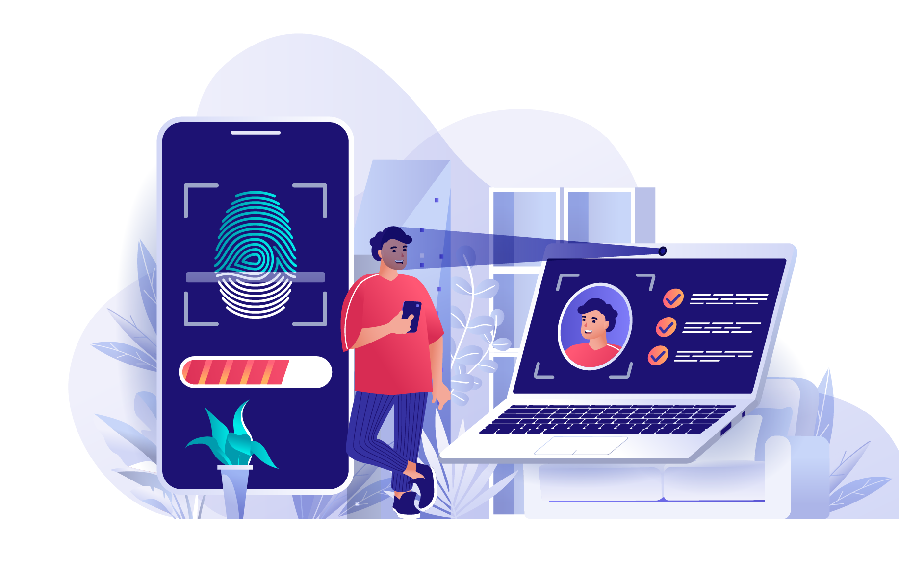

Passwordless
============

> Less passwords, more security!

<iframe src="form.html" style="width:100%;height:300px;border:none;"></iframe>

> Disclaimer: this demo only stores information locally on your device, it does not send *anything* remotely.

 F.A.Q. 
---------------------------------------------

### Is my fingerprint/face sent to the server? 

**No.** Your fingerprint, face or other biometrics never leaves your device.
The biometric verification is a security constraint that occurs locally on your device
to create and access security keys (similar to large random passwords).

### How does it work exactly? 

It relies on [asymetric cryptography](https://en.m.wikipedia.org/wiki/Public-key_cryptography). 
Upon registration, a cryptographic key pair is generated.
The private key kept on the device, protected by biometrics,
while the public key is sent to the server.
In combination, they can be used to encrypt and decrypt messages respectively.
For more technical details about the protocol, check the webauthn guide.

### Is it more secure than passwords? 

**Yes.** It is basically a two-factor authentication in a single step. 

- The first factor is something you have. 
The authentication only works on registered devices. 
- The second factor is something you are, or something you know. 
A biometric verification, or the device PIN code, is required.

Moreover:

- It protects against phishing (article coming soon)
- The cryptographic keys are never exposed (article coming soon)

### What if my device is stolen? 

If your device is stolen and the thief can unlock it (for example if the pattern is trivial),
then the thief has full control over your phone and could possibly also impersonate you.
In this case, it is important to remove that device from the list of authorized devices.

---

What is this website about?
---------------------------

Currently, this is just a demo, a few guides, tips and resources about the recent webauthn protocol.

In the future, "Passwordless" is planned to become a "universal authentication platform".
A free public webservice to let:

- any user register/authenticate
- any app/service know who the user is (provided the user allows it)

The goals are multiple.
Make the web a safer place,
make it easier for developers,
make it more comfortable for users.

---

It is "work in progress" ;)
---------------------------

