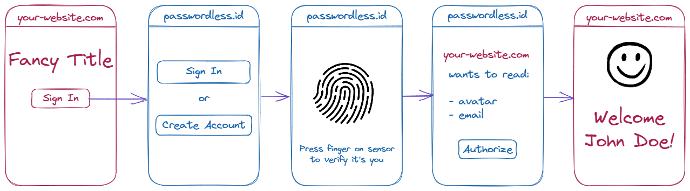

<link rel="stylesheet" href="index.css">

Passwordless
============

<center>
> Ditch passwords, boost security!
</center>


---


Sign in with...
---------------

Passwordless.ID is a public identity provider that can be used out-of-the-box, compatible with *OAuth2* and *OpenID*. 



It's really simple. Authentication can be triggered by a simple link, with no configuration required.
These buttons are just links.

<div class="d-grid gap-2 col-sm-6 mx-auto">
    <script type="module" src="js/sign-in-with.js"></script>
    <a id="sign-in" class="btn btn-primary btn-block" href="https://api.passwordless.id/openid/authorize?scope=openid+email+avatar&response_type=id_token&client_id=https%3A%2F%2Fpasswordless.id&redirect_uri=https%3A%2F%2Fpasswordless.id">Sign in</a>
    <div id="profile" hidden>
        <div>
            <span id="nickname"></span>
        </div>
        <a id="account" class="btn btn-primary btn-block disabled" href="https://ui.passwordless.id">Account profile</a>
        <a id="sign-out" class="btn btn-primary btn-block disabled" href="https://api.passwordless.id/openid/logout?redirect_uri=https%3A%2F%2Fpasswordless.id">Sign out</a>
    </div>
</div>

For more information on how this works, consult the [documentation](https://passwordless.id/docs/1_big_picture) or to get started quickly, take a look at the "Usage" demos.
Lastly, there is also the [@passwordless-id/connect](https://github.com/passwordless-id/connect) library for an even smoother and easier client side integration.


---


Your fingerprint/face never leaves your device
----------------------------------------------

Biometric verification uses the *local authentication* mechamism of your device. On the device, these biometric information is strongly protected and never exposed.

Verification is a safety measure used to prove that you are you, and then to create or access cryptographic keys stored on your device. These keys, also known as passkeys, are in turn used for the authentication mechanism.


---


Safer than passwords
--------------------------

It is basically *two factor authentication* in a *single step*.

- The first factor is something you own. 
Authentication only works on allowed devices. 
- The second factor is something you are, or something you know. 
It requires biometric verification or the device PIN code.

The combination of both is required in order to authenticate the user.


---


You can choose <i>not to use</i> fingerprint/face
-------------------------------------------------

User verification is delegated to your platform. If you are uncomfortable with such a mechanism, you can still use a PIN, a password, a configured swipe pattern, or whatever is configured on your device as a local authentication mechanism.


---


It protects you from phishing
-----------------------------

Phishing usually involves tricking a user into entering their password into a fake website, or other approaches such as social engineering. It is the most common way of hacking accounts.

By getting rid of passwords, you get rid of phishing! Great, right?

As long as you don't possess an allowed device, you will not be able to sign in.


---


Multi-device and platform neutral
---------------------------------

Authentication only works for allowed devices, but of course you can register another device simply by scanning a QR code or clicking on a link. Each device can then be used to authenticate directly using its own local authentication mechanism (for example TouchID on your phone, and PIN on your laptop).

Depending on the platform you use, your passkeys *may* also be automatically synced into the cloud by its built-in password manager, propagating to all devices of the same platform (Windows, Android or iOS).


---


How does it work exactly? 
-------------------------

The authentication relies on a recent browser protocol called [WebAuthn](/protocols/webauthn/1_introduction), which is based on [asymmetric cryptography](https://en.m.wikipedia.org/wiki/Public-key_cryptography). 

Upon registration, a cryptographic key pair is generated for the user.
The private key is stored on the device, protected by local authentication, while the public key is sent to the server.

When a user wants to authenticate themselves, they must sign a random "challenge" using their private key. This signature is sent to the server, which verifies it against the user's public key. 


---


By developers, for developers
-----------------------------

One of the goals of this project is to make it as easy to use as possible.
You can use this form of authentication for your website right now, with no hassle.
This is a public identity provider, so not even an account is necessary.

A single redirect is required for authentication and authorization.

```html
<a href="https://api.passwordless.id/openid/authorize?scope=avatar">Sign In</a>
```

Once the user has signed in and granted the access rights, it will be redirected back to the origin.

Likewise, a single request is enough to obtain the user profile.

```js
const res = await fetch("https://api.passwordless.id/openid/userinfo")
if(res.ok)
    alert(await res.json()) // shows profile
else if(res.status === 401)
    alert('Please login first')
else if(res.status === 403)
    alert('Access denied by the user')
```

Check out the [user guide](usage/sign-in-with) for more details.


---


OAuth2 / OpenID compatible
-------------------------

Passwordless.ID is compatible with both *OAuth2* and *OpenID* protocols. That way, you can use it as a generic OpenID provider for a "Sign in with..." button.

If you are familiar with OAuth, you probably know that it is an "authorization" protocol. Usually, the API also provides a set of operations to grant permission to. In the case of Passwordless.ID, the only operation is accessing (part of) the user profile.

If you want to add Passwordless.ID as an additional social login provider using some predefined library, check out our [OAuth2/OpenID guide](/usage/openid)! 


---


What if I lose my (single) device? 
----------------------------------

If you have only a single device registered, losing it *may* cause locking yourself out of your account. This happens if your platform's built-in password manager has not synced the passwordless credential in the cloud. In this case, the only private key used to sign in would be lost.

Nevertheless, the user can also choose which recovery options they accept. From the convinient but less secure e-mail, to more secure ones like SMS and Backup codes.
Similarly, if your device is stolen or at risk of being compromised, it can be blocked.


---


The vision
----------

"Passwordless.ID" is meant to be a "free public identity provider" with the following philosophy.

- Make the web a safer place
- Make it easier for developers
- Provide more convenience and control for users

This is achieved by providing tools and services to delegate the authentication to the Passwordless.ID API.


---


If you like it, share it!
-------------------------

This was made with love, sweat, and thoughtfulness. We strive to provide the best authentication experience possible and welcome any feedback.

If you like it, tell others about it! Share it with someone! Every little act helps make it a success. Thank you very much!

If you are planning to write a blog article, tutorial, news or something similar, we would love to hear from you. Maybe we can publish it on our blog!

