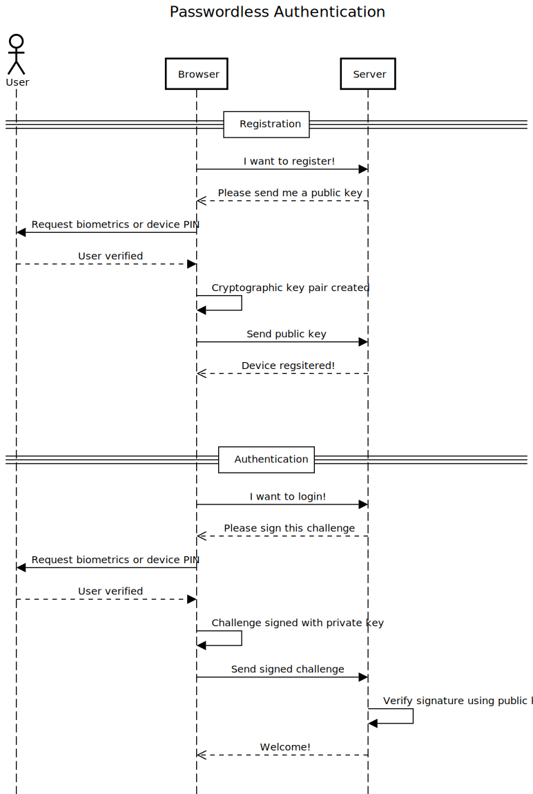

Overview
========

Introduction
------------

WebAuthn (Web Authentication) is a [standard](https://www.w3.org/TR/webauthn/)  for securely authenticating users on the web using public-key cryptography. It is designed to replace traditional password-based authentication with a more secure and user-friendly method.

WebAuthn allows users to authenticate themselves using a variety of different methods, including biometric authentication (such as fingerprint or facial recognition) and hardware security keys. It is based on the FIDO2 (Fast IDentity Online) standard and is supported by most modern web browsers.

One of the main advantages of WebAuthn is that it allows users to authenticate themselves using devices they already own, such as their smartphone or a hardware security key. This means that users don't need to remember complex passwords or use less secure authentication methods, such as SMS-based authentication.

WebAuthn is increasingly being used by websites and applications as a more secure and convenient alternative to traditional password-based authentication. It is also being adopted by governments and other organizations as a way to securely authenticate users for online services.

How does it work?
-----------------

WebAuthn works by creating a pair of public and private keys for each user. The private key is stored on the user's device (such as a smartphone or a hardware security key), while the public key is stored on the server of the website or application that the user is trying to access.

When a user wants to authenticate themselves, they use their device to generate a signed message (called an "assertion") using their private key. This assertion is sent to the server, which verifies it using the user's public key. If the assertion is valid, the server allows the user to access the website or application.

### Registration

1. A challenge (webauthn vocabulary for a [nonce](https://en.wikipedia.org/wiki/Cryptographic_nonce) is generated server-side
2. The user is prompted to enter biometrics (fingerprint/face) or pin/password of the device
3. A cryptographic key pair is created
4. The public key (among others) is sent to the server
5. The server verifies the challenge, optionally verifies the attestation and stores the public key

### Authentication

1. A challenge is generated server-side
2. The user is prompted to enter biometrics (fingerprint/face) or pin/password of the device
3. The private key is used to sign the message including the challenge
4. The server verifies the challenge and the signature using the previously stored public key

Specifications
--------------

The [Official Specification](https://www.w3.org/TR/webauthn/) is authored by a W3C group.

> DISCLAIMER
> 
> The specification itself is large, complex and with many details to consider.
> Moreover, the specification is still evolving and browser implementations might slightly diverge from what is defined in the specifications.

Introduction
------------

The basic flow may look as follows.

Other useful websites
---------------------

- https://github.com/w3c/webauthn
- https://webauthn.io
- https://webauthn.guide
- https://webauthn.me