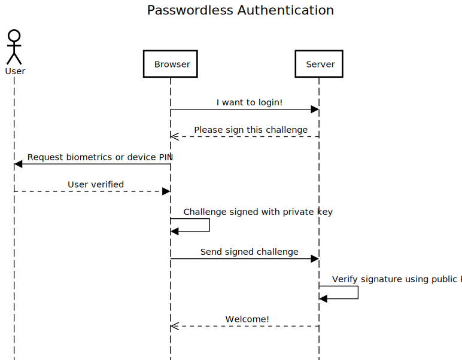

Authentication
==============

The authentication has similar steps to the registration, and depicted in the sequence diagram below.




### 1. Request a challenge from the server

The challenge is basically a [nonce](https://en.wikipedia.org/wiki/Cryptographic_nonce) to ensure the authentication payload cannot be reused in replay attacks. It is just a bunch of bytes randomly generated from the server.


### 2. Trigger the webauthn protocol in the browser side

This is done like this:

```js
let assertion = await navigator.credentials.get({
  publicKey: {
    challenge: Uint8Array.from(
        randomStringFromServer, c => c.charCodeAt(0)),
    allowCredentials: [{
        id: Uint8Array.from(
            credentialId, c => c.charCodeAt(0)),
        type: 'public-key',
        transports: ['internal', 'hybrid','usb', 'ble', 'nfc'],
    }],
    timeout: 60000,
}
});
```

It's interesting to note that there are two possible usages / behaviors here:

1. Providing `allowCredentials` with the list of credential IDs allowed
    - typically fetched alongside the challenge from the server for a given username
2. Leaving `allowCredentials` as an empty list
    - a UI will pop up to let you choose a credential you already registered here
    - how the UI looks is platform specific, quite recent, still evolving, and a bit buggy from my experience

The `transports` defines how the user can authenticate. `internal` is to let the device use the local authentication method, `hybrid` is authentication on a desktop computer using a smartphone for example and let the platform decide how, `usb` for security keys, `ble` for bluetooth and `nfc` for NFC.

Once the user "authenticates" locally, using biometrics like fingerprint, swiping a pattern or whatever the platform offers, the method returns.

Again, what you obtain is not a JSON like structure, but an object filled with ArrayBuffers and a few methods.

It looks like this:

```
{
   authenticatorAttachment: null,
   id: "IJeOSAbRJ4FNTS1aF5D...",
   rawId: ArrayBuffer(32),
   type: "public-key",
   response: {
     authenticatorData: ArrayBuffer(37)
     clientDataJSON: ArrayBuffer(138)
     signature: ArrayBuffer(71)
     userHandle: ArrayBuffer(32)
}
```

Like with the registration, you cannot just send it like this to the server, but you must first encode it in some JSON, usually by base64url-encoding these ArrayBuffers. 

Validation
----------

When "decoding" these array buffers, which are kind of low-level structures, you will obtain various information that you must validate. Most notably the signature, which proves that the provided information is authentic, that the one sending the payload is in possession of the private key.

Roughly speaking, the `authenticatorData` which is a sequence of bytes provides following information:

```
{
  "rpIdHash": "SZYN5YgOjGh0NBcPZHZgW4_krrmihjLHmVzzuoMdl2M=",
  "flags": {
    "userPresent": true,
    "userVerified": true,
    "backupEligibility": false,
    "backupState": false,
    "attestedData": false,
    "extensionsIncluded": false
  },
  "counter": 1
}
```

The `clientData` is simpler, it is just a UTF-8 string representing raw JSON, and decoded looks like this:

```
{
  "type": "webauthn.get",
  "challenge": "24d224d3-1d0f-4301-8759-398870585e55",
  "origin": "http://localhost:8080",
  "crossOrigin": false
}
```

Both of these payloads have to be verified for their validity and the signature too using the public key and signature algorithm obtained during registration.

The "data" that is signed is the `authenticatorData` byte array concatenated with the `sha256` hash of `clientData`.