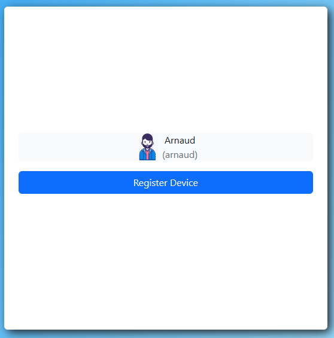
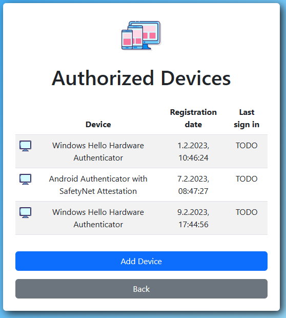
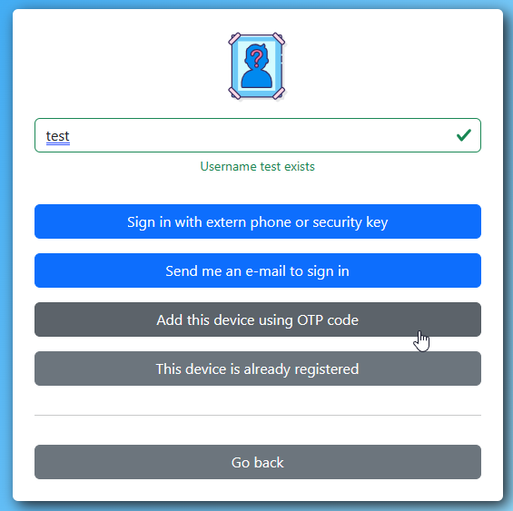
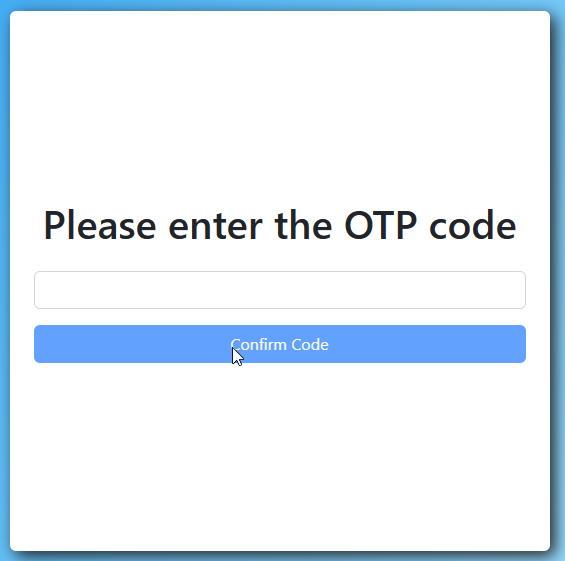

Screenshots
===========

## Authentication on various platforms

The screenshots were taken using my own phone/laptop with a German locale, sorry guys. 😅

The cornerstone of this authentication service is to delegate user verification to the local platform. You may use your device's fingerprint sensor, some swipe pattern, windows hello with face recognition or even plain old passwords ...whatever is configured on your device locally.

By the way, if anybody could provide me a screenshot from a Mac or IPhone, that would be great!

## Creating a new user

Creating a new user only requires a username. An e-mail address (although useful) is entirely optional. Why? Because there is no need for "I forgot my password"!

Upon clicking "Create Account" you will be prompted for local authentication. Once done your account is created. That's it. What follows is simply defining your profile ...if you want to.

## Signing in

Once you pick your avatar, you must prove it's you by using local authentication. Don't worry, none of the information like fingerprint or pin codes is ever sent to the server. It is used locally to *sign* a message using asymmetric cryptography and prove you are you.

## OAuth2 / OpenID flow

That is the whole purpose of this service. So that any website on the internet can easily ask "Who are you?". Since it is public, you can use it out of the box, even without account.

## Managing devices

One of the more unusual aspects of this kind of authentication is that it is more secure by default. Only your registered devices can sign in. As such, it is important to easily add a new device.

Once you scan the QR code, you will be able to register your other device directly.

And after a while, you may end up with several authorized devices.

If you cannot scan the QR code or open the link in the e-mail, you can also enter the OTP code manually.

## Recovery options

Now, if you have registered only a single device, without email or phone, you might be in trouble. In that case, losing your device would make it impossible to connect to your account anymore. That's why the interface emphasizes user guidance. It is a new topic for the users too.

After a classic e-mail confirmation, it looks already much better. Alternatively, you could also have just registered another device per QR Code. Both are ways to ensure safety.

## E-Mail confirmation and recovery

---

Although screenshots are good for a first impression, they do not really convey how the UI "feels like". The interaction and navigation is a big part of it. I recommend trying out the [demo](https://passwordless-id.github.io/demo/) to experience it for yourself.