Screenshots
===========

Authentication on various platforms
-----------------------------------

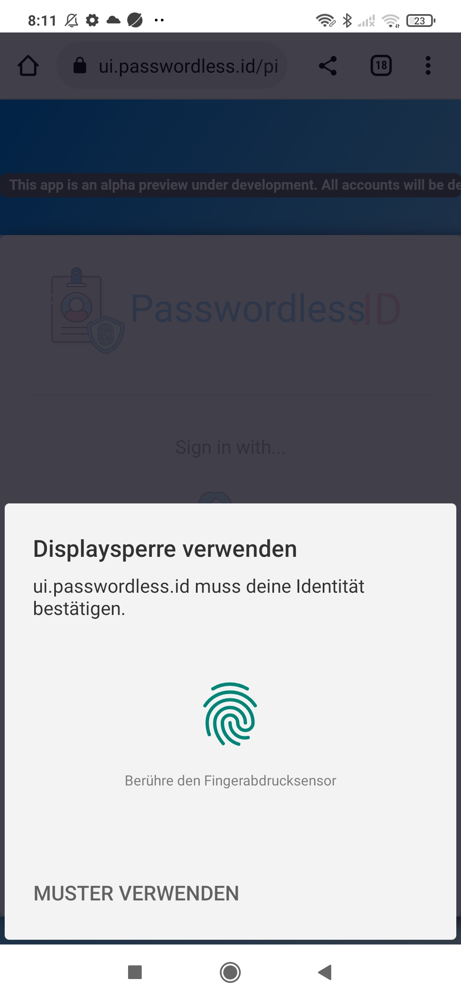
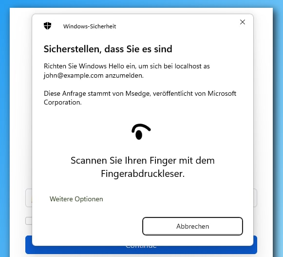
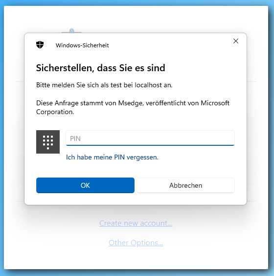

If anybody could provide me a Mac or IPhone screenshot, that would be great!

Creating a new user
-------------------

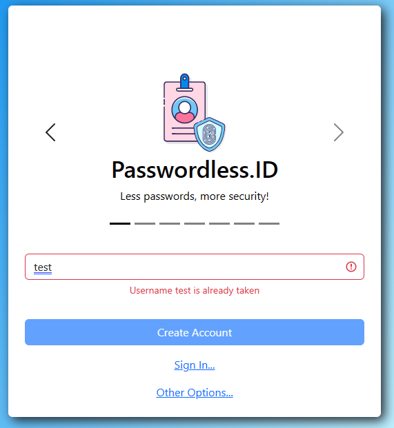
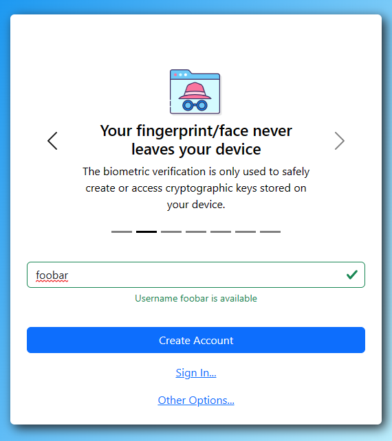
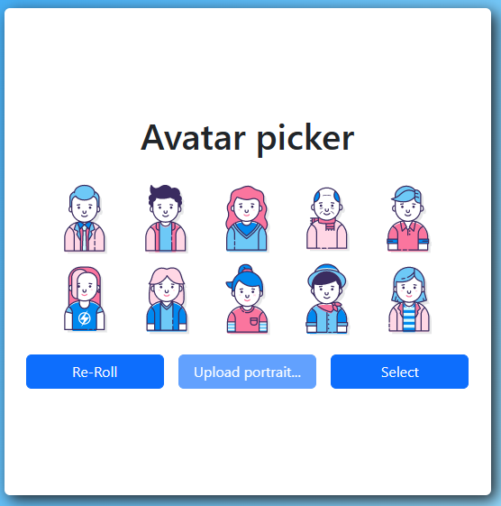
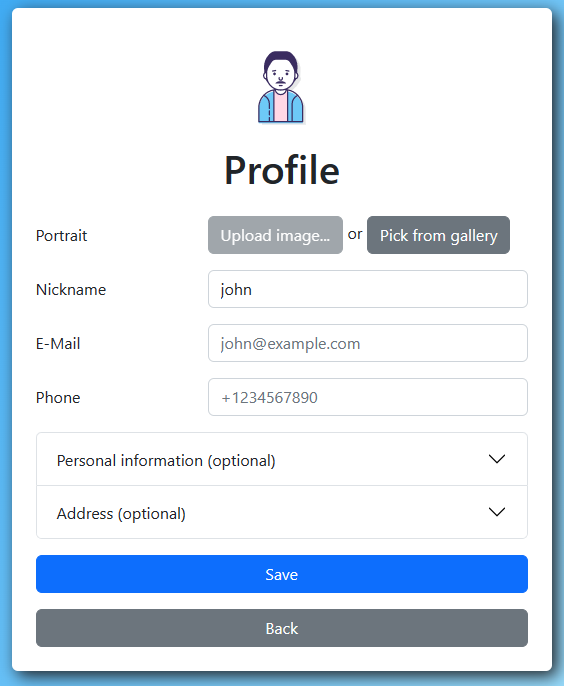
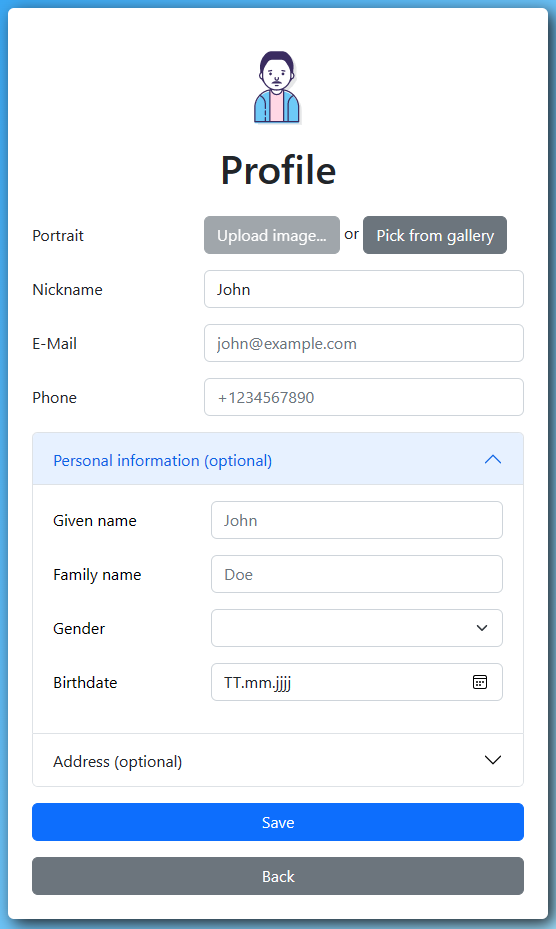

Signing in
----------

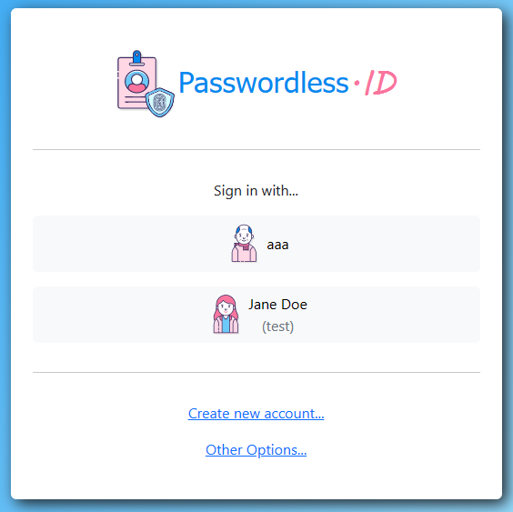

Then comes a native authentication prompt.

TODO: user

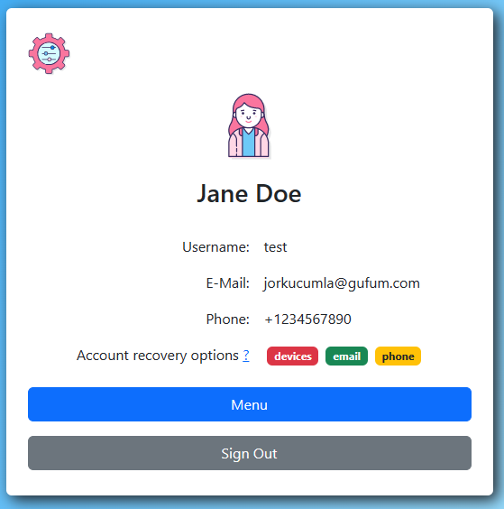

OAuth2 / OpenID flow
--------------------

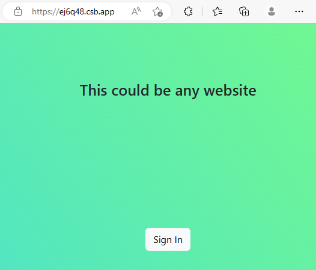
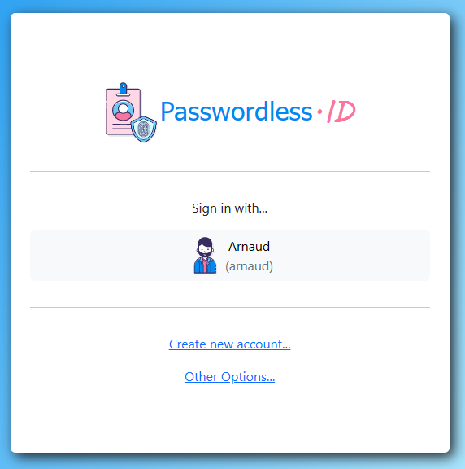
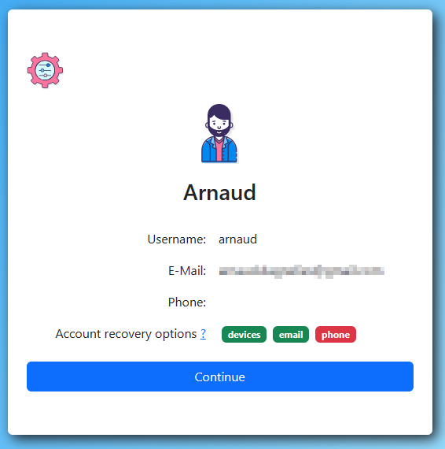
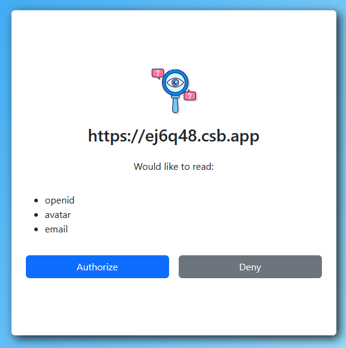
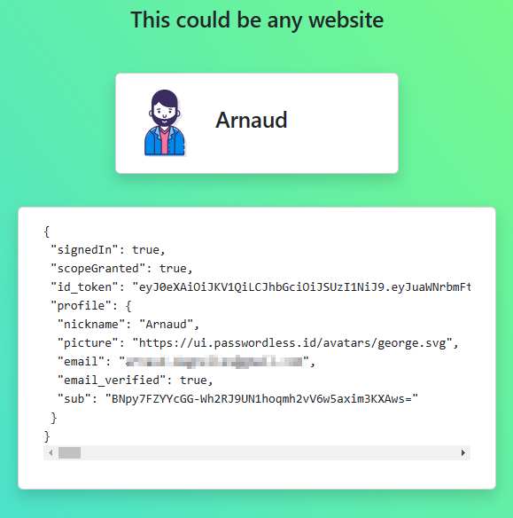

Managing devices
----------------

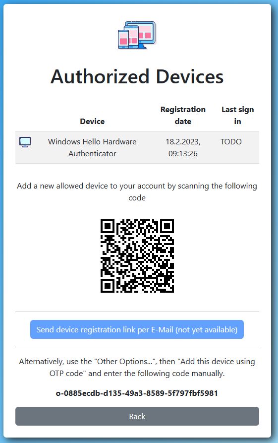

TODO: that's already available ...just screenshots are missing

Recovery options
----------------

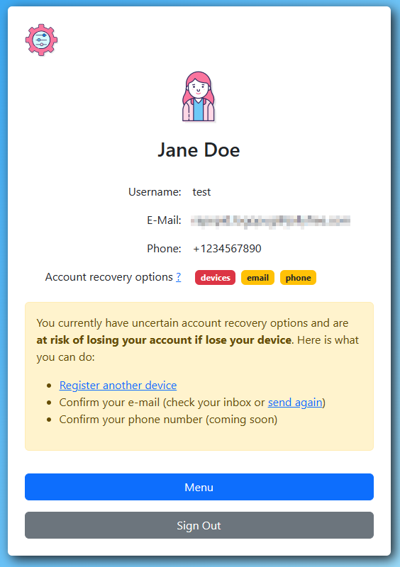
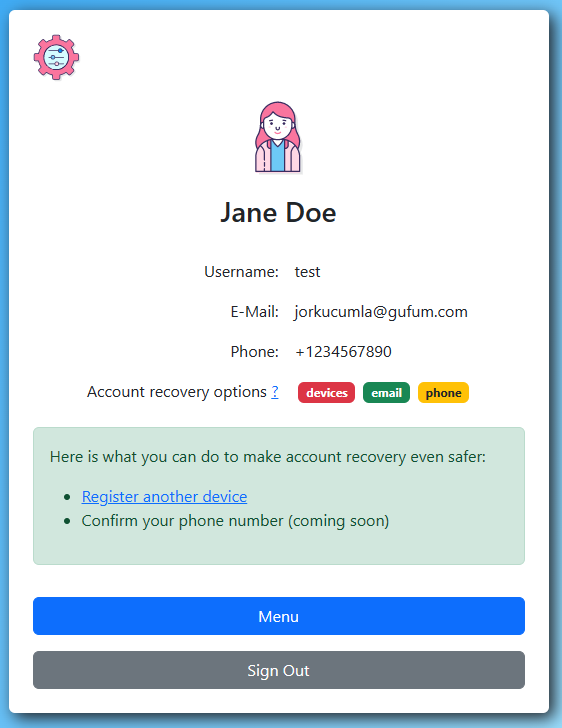
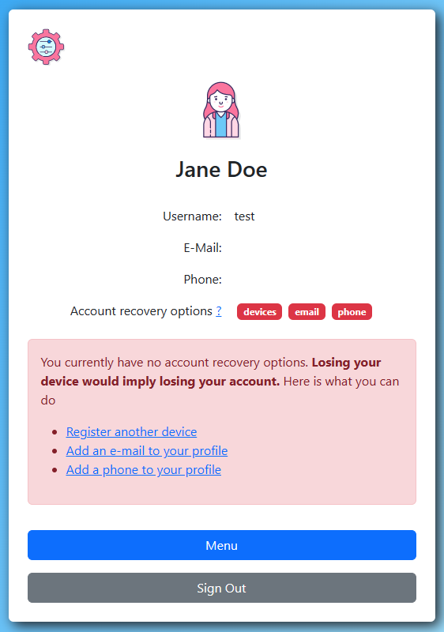

Options and settings
--------------------

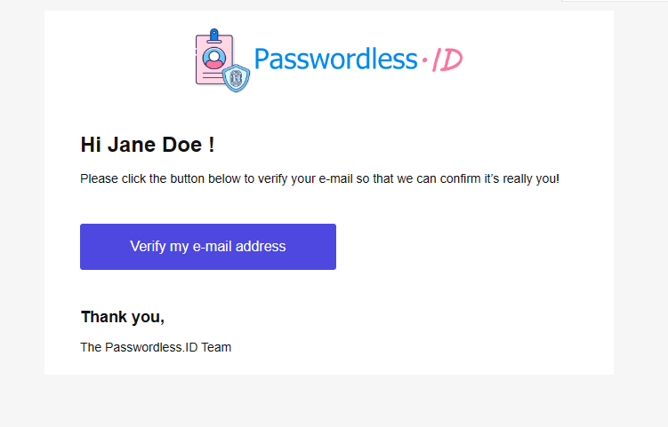
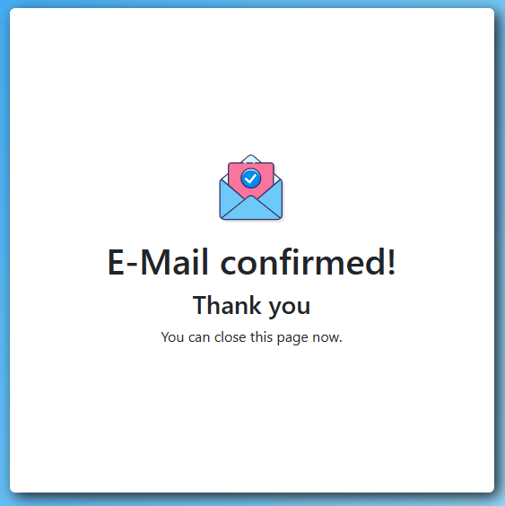
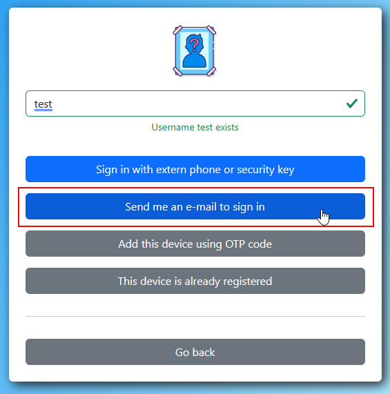
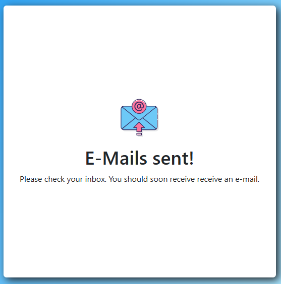
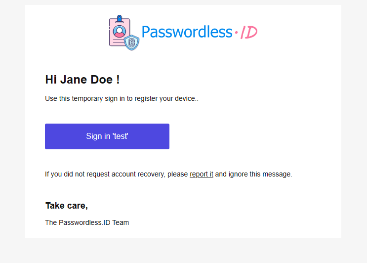

