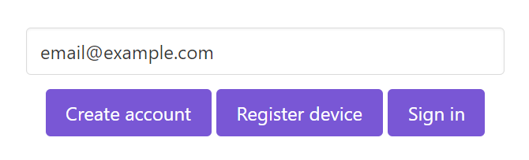
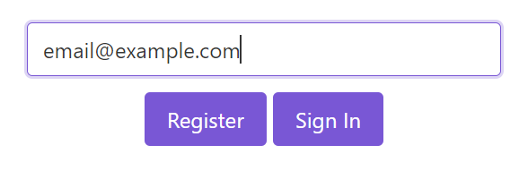
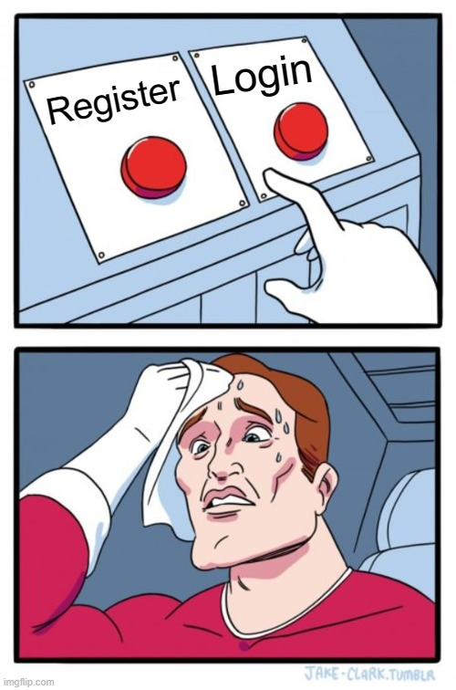

User guidance
=============

With traditional authentication paradigms like passwords, it is utterly simple: you register once and for all, then only sign in.
For OAuth2 flows, it is often even slightly simpler since it is just "Sign in with <some-provider>".

However, for webauthn, the reality is both more subtle and more complex.
Basically, you have three options available:

- Create a new account
- Register an additional device for this account
- Login using one of the known devices

The fictive login screen might look like the picture below.

This is kind of heavy user experience.
Moreover, creating an account and registering a device are in one aspect similar.
Both involve the creation of a public key credential.

Therefore, it might make sense to reduce it to two buttons:

- Register: create a new public key credential added to a newly created account
- Login: use a know public key credential to log in

And while we are at it, make it look similar to familiar authentication dialogs.

Register vs Login
-----------------

It might appear trivial at first sight which one to click ...but it is not!

To illustrate the issue, let us follow the journey of some imaginary new user.

In the morning, the user registers with its laptop. Great. It works, the laptop is now registered.

In the afternoon, the user want to check it out with its phone. 
Hmmm... intuitively, the user might click on "Sign In".
**Boom! +1 in user confusion.**

> Hey? What's going on?! I just want to sign in but for whatever reason, the phone always asks me to plug in security keys or use some external device?! I cannot sign in!

Now then. That was the wrong button. The user should have pressed "Register" (device) on the phone.

The day after, our dear imaginary user might go to work and be tempted to access his account from the workplace PC. Because his last experience was not so succesful, he thinks "Ok, new day, new luck, I'm on a new PC, let's register this time!". **Boom! +1 in user confusion.**

> Wtf?! I clicked register with my phone per NFC and it tells me the device is already registered!

Now, the user feels like this:

You may downplay it by saying users just have to get used to it and that they will figure it out quickly.
But that's not how the world works. Users want things to simply work. If they get confused or irritated by the registration/login process, they will dislike it profoundly, perhaps even going as far as using another product instead.

A good user experience is crucial. How to achieve it with webauthn, I do not know.