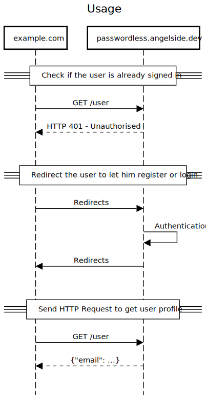

Usage
=====

This is based on five components:

- a JS helper library
- a Java helper library
- a REST API
- a frontend UI
- an out-of-the-box authentication service
 
Service Usage (planned)
=======================

This authentication platform can be used in three possible ways.
From the simplest out-of-the-box to a fully customized experience.

Direct
------

This is the simplest method, using redirects. It simply requires your website to redirect to this platform to let the user authenticate.
Once the user registered or signed in, you will be redirected back to your website.
There, a simple `GET /user` is enough to get the user's profile.

Embedded
--------

If you don't want your users to leave your website/app, 
you can also use embedded iframes to display the sign in/up pages and the other options.
The other advantage is that you can adapt the theme to fit the style of your UI better.

Programmatic
------------

If you want complete control over the UI, it is possible too.
You can do just that, taking care of the entire UI,
and solely rely on the REST API of this service for the data management.
The REST API will take care of verifying signatures, validate payloads,
manage multiple devices, send e-mails, SMS and so on.

Authorization token
-------------------

**TODO**

Comparison
----------

| Method       | Core principle       | Difficulty   | Customizable  | Account     |
|--------------|----------------------|--------------|---------------|-------------|
| Direct       | HTTP Redirects       | easy         | no            | centralized |
| Embedded     | Iframes              | intermediate | basic theming | independent |
| Programmatic | Scripting + REST API | advanced     | full control  | independent |

*Difficulty*: The required development effort
*Customizable*: How much the UI and behavior can be altered
*Account*: Whether the profile, registered devices and security settings are centralized or specific to your organization.

One important thing to consider is how the out-of-the-box solution (per redirect) affects the registration process and account management compared to the two other solutions.

### Centralized

In this case the profile, registered devices and security settings of the user are centralized.
They are shared among all services using this out-of-the box redirects method.
If the user changes its display name, all services call `GET /profile` will the updated values instantly.
This also means that if the user already registered though another third-party, the user will not need to re-register or re-validate its e-mail.
It will simply be asked consent that your website can read its profile.
This offers the user a centralized way to manage their online identity, security settings and webapps permissions.

### Independent

The users will be stored separately.