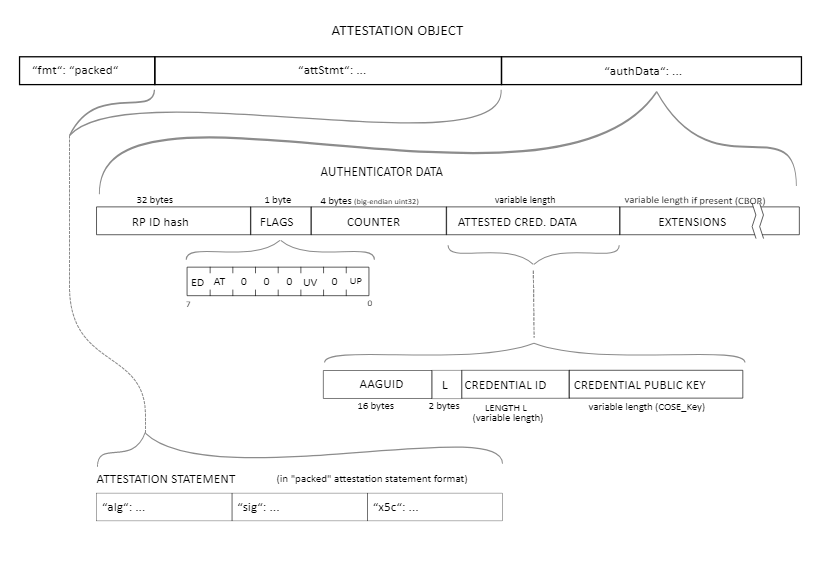

Webauthn Guide
==============

Utilities
---------

The interface to deal with the creation and usage of credentials are mostly relying on binary data objects.
Sometimes 

Registration
------------

### Call

### Raw Response

### Attestation

(from https://w3c.github.io/webauthn/#sctn-attestation)

### Decoded Response

Login
-----
