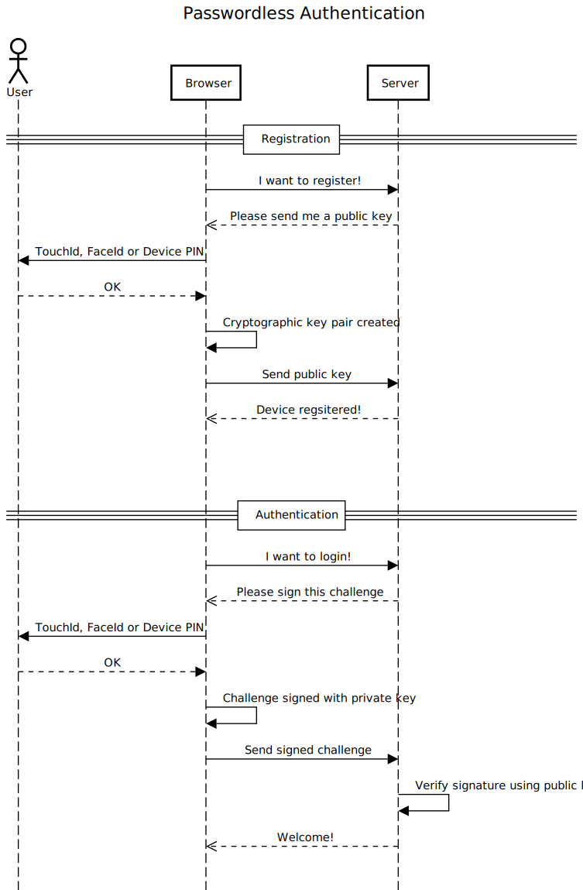

Overview
========

Official specification: https://www.w3.org/TR/webauthn/

Repo: https://github.com/w3c/webauthn/

Useful websites:

- https://webauthn.io
- https://webauthn.guide
- https://webauthn.me




<details>
  <summary>Diagram source</summary>

https://sequencediagram.org/

```
title Passwordless Authentication

actor User

==Registration==

Browser->Server: I want to register!
Browser<<--Server: Please send me a public key
Browser->User: Request biometrics or device PIN
User-->Browser: User verified
Browser->Browser: Cryptographic key pair created
Browser->Server: Send public key
Browser<<--Server: Device regsitered!

space
space

==Authentication==

Browser->Server: I want to login!
Browser<<--Server: Please sign this challenge
Browser->User: Request biometrics or device PIN
User-->Browser: User verified
Browser->Browser: Challenge signed with private key
Browser->Server: Send signed challenge
Server->Server: Verify signature using public key
Browser<<--Server: Welcome!
```

</details>
