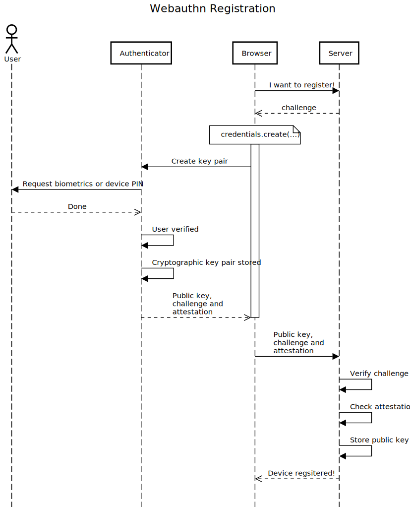

Registration
============

Minimal example
---------------

Simply open the browser dev tools and run it in the console!

```js
let credential = await navigator.credentials.create({
  publicKey: {
    challenge: Uint8Array.from(
        "random-string-from-server", c => c.charCodeAt(0)),
    rp: {
        name: "Try it in the console!",
        id: window.location.hostname
    },
    user: {
        name: 'John Doe',
        displayName: 'Johny',
        id: Uint8Array.from("for-the-device-to-identify-user", c => c.charCodeAt(0))
    },
    pubKeyCredParams: [] // if empty, either ES256 or RSA256 will be used by default
  }
});
```

There are many more options that can be used. This solely describes the most basic use case.
If you run this snippet, a browser specific popup should appear and will ask to proove your identity. In my case (german locale) in looks like this:


 


Depending on your case, you might use the device directly, your smartphone nearby, or some security key to proove your identity using it.

How exactly you prooe your identity depends on the device capabilities, the OS, the browser... At some point, you will to either use some biometric or PIN on the device. This device is then called the "authenticator" and will produce a cryptographic private/public key pair.

The private key will be kept secret, stored on the device and protected by your biometric or PIN code. The public key will ulimately be sent to the server so that it can authentify you next time.

So, what's the result of this call? A "PublicKeyCredential" and the start of your headhaches. ;) It's not some JSON that you can send over, it's an object with encoded byte buffers.

```js
PublicKeyCredential {
   id: 'AQtKmY-...',
   rawId: <ArrayBuffer>,
   response: {
       attestationObject: <ArrayBuffer>,
       clientDataJSON: <ArrayBuffer>
   }, 
   authenticatorAttachment: 'cross-platform',
   type: 'public-key'
}
```

The flow
--------




<details>
  <summary>Diagram source</summary>

```
title Webauthn Registration

actor User
participant Authenticator

Browser->Server: I want to register!
Browser<<--Server: challenge
note over Browser: credentials.create(...)
activate Browser
Browser->Authenticator: Create key pair
Authenticator->User: Request biometrics or device PIN
Authenticator<<--User: Done
Authenticator->Authenticator: User verified
Authenticator->Authenticator: Cryptographic key pair stored
Authenticator-->>Browser: Public key, \nchallenge and \nattestation
deactivate Browser
Browser->Server: Public key, \nchallenge and \nattestation
Server->Server: Verify challenge
Server->Server: Check attestation
Server->Server: Store public key
Browser<<--Server: Device regsitered!
```

</details>


Creating a new key pair
-----------------------

This is done using [navigator.credentials.create]()(...)

The provided object is a [PublicKeyCredentialCreationOptions](https://w3c.github.io/webauthn/#dictdef-publickeycredentialcreationoptions)

let publicKeyCredentialCreationOptions = {
    *"rp":{
      "id": ...,
      *"name":"..."
    }
    required PublicKeyCredentialUserEntity       user;

    required BufferSource                             challenge;
    required sequence<PublicKeyCredentialParameters>  pubKeyCredParams;

    unsigned long                                timeout;
    sequence<PublicKeyCredentialDescriptor>      excludeCredentials = [];
    AuthenticatorSelectionCriteria               authenticatorSelection;
    DOMString                                    attestation = "none";
    AuthenticationExtensionsClientInputs         extensions;
};
